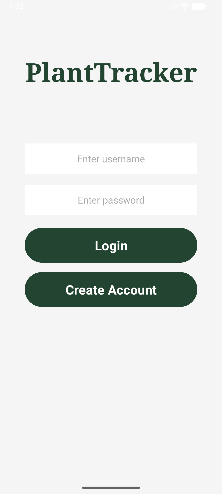
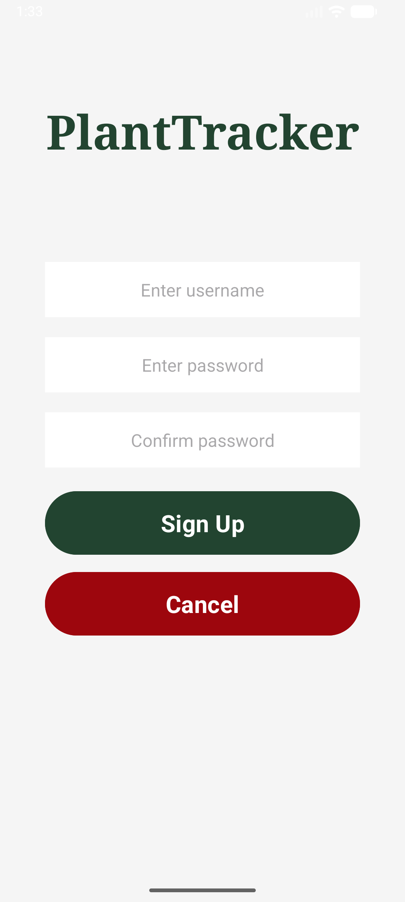
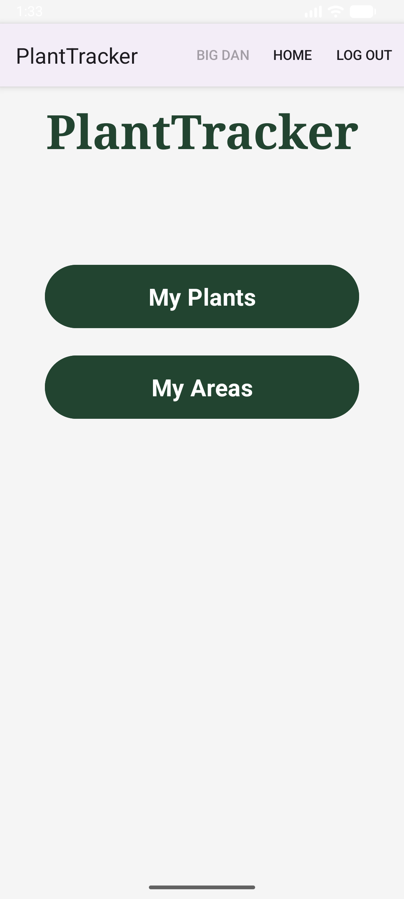
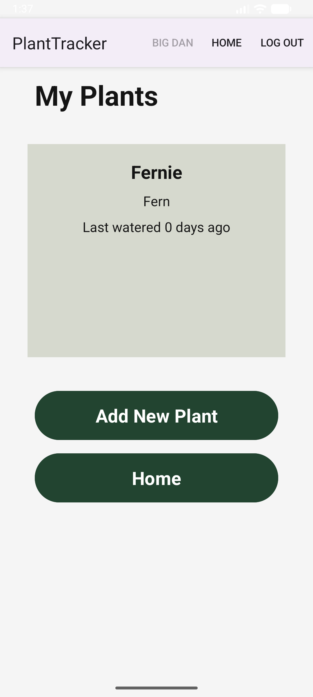
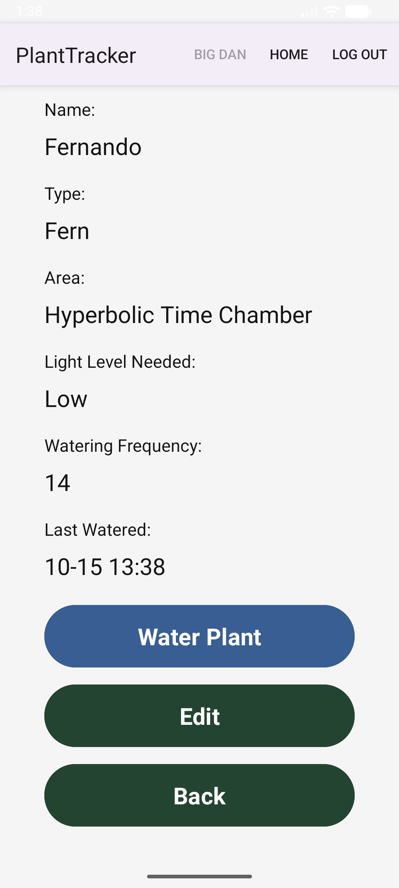
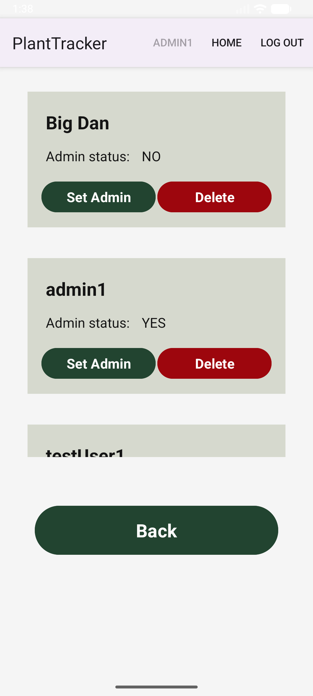
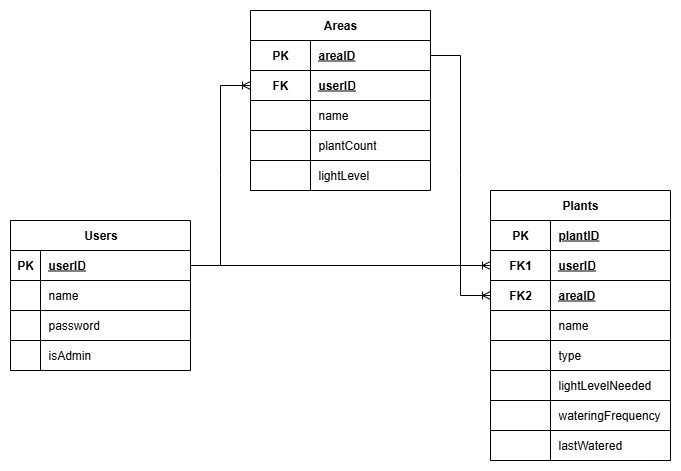

# PlantTracker

**PlantTracker** is an Android application for tracking, organizing, and managing houseplants. It is implented with Java, Android Studio, and the Room persistence library. 

## Features

- **User Profiles**: Supports account creation and login. All user data is stored on the local device using an SQLite database abstracted by the Room library.
- **Plant Registration**: Users can add plants to the PlantTracker app and input details like name, type, light level, and watering frequency.
- **Area Organization**: Users can create custom areas and add plants from their collection,  making plant care and organization simple.
- **Watering Reminders**: Users can set up custom watering schedules for each plant in their collection. Plants are sorted by watering schedule, and any overdue plants are highlighted.
- **Admin Options**: Administrators can update and delete user accounts in-app through a convenient Admin Options page.

### Login and Sign Up





### Home Page



### Plant Creation and Editing






### Admin Options



### Database Structure



## Installation

In order to run this project, follow the following steps:

1. Clone this repository:
   ```bash
   git clone https://github.com/danielkarnofel/PlantTracker.git
   ```

2. Open the project in Android Studio.

3. Build the project to ensure all dependencies are resolved.

4. Run the app on an emulator or a connected Android device.

This project was created for CST 338: Software Design at CSUMB. \
Feel free to reach out with any questions or suggestions. Happy planting!
